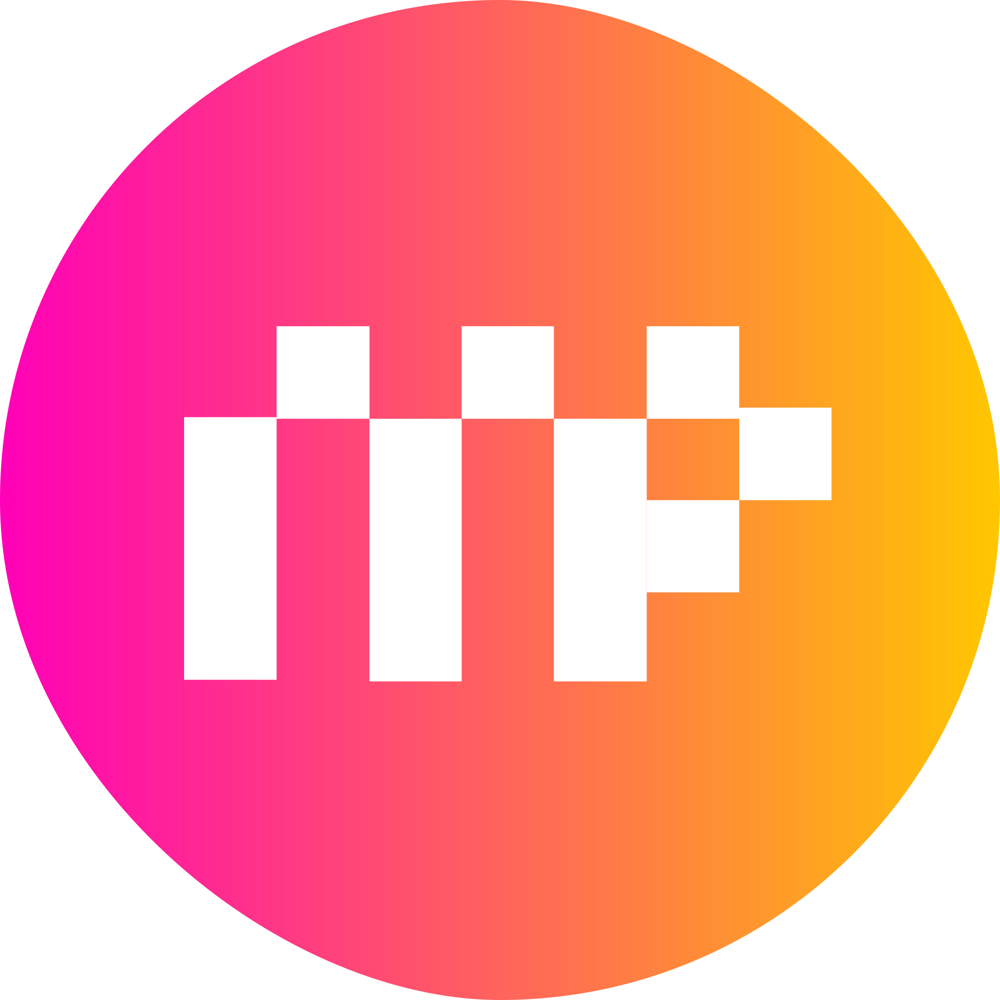

<div id="top"></div>

<br />
<div align="center">
  <a href="https://github.com/MinorityProgrammers/MPA-website">
    
  </a>

  <h3 align="center">Minority Programmers Web Application</h3>

  <p align="center">
    This README explain what MPA's goals are and how to run this repository locally
    <br />
    <a href="https://github.com/MinorityProgrammers/MPA-website"><strong>Explore the docs »</strong></a>
    <br />
    <br />
    <a href="https://github.com/MinorityProgrammers/MPA-website">View Demo</a>
    ·
    <a href="https://github.com/MinorityProgrammers/MPA-website/issues">Report Bug</a>
    ·
    <a href="https://github.com/MinorityProgrammers/MPA-website/issues">Request Feature</a>
  </p>
</div>


<!-- TABLE OF CONTENTS -->
<details>
  <summary>Table of Contents</summary>
  <ol>
    <li>
      <a href="#about-the-project">About The Project</a>
      <ul>
        <li><a href="#built-with">Built With</a></li>
      </ul>
    </li>
    <li>
      <a href="#getting-started">Getting Started</a>
      <ul>
        <li><a href="#prerequisites">Prerequisites</a></li>
        <li><a href="#installation">Installation</a></li>
      </ul>
    </li>
    <li><a href="#roadmap">Roadmap</a></li>
    <li><a href="#contributing">Contributing</a></li>
    <li><a href="#license">License</a></li>
    <li><a href="#contact">Contact</a></li>
    <li><a href="#learn-more">Acknowledgments</a></li>
    <li><a href="#deploy-on-zeit-now">Acknowledgments</a></li>
  </ol>
</details>


<!-- ABOUT THE PROJECT -->
## About The Project

[![Product Name Screen Shot][product-screenshot]](https://minorityprogrammers.com/)

<p>
This project contains the MPA web application. Below are the wireframe and site-map. Click on any of the images to view more </p>

[![Site-map][site-map]](https://www.figma.com/file/a47vM8yGurIjdPNMGK68Fc/MPA-Website?node-id=0%3A1)
[![Wireframe][wireframe]](https://www.gloomaps.com/QhqVqahMN9)


### Built With

The technologies used in this project include:

* [Next.js](https://nextjs.org/)
* [React.js](https://reactjs.org/)
* [Solidity](https://docs.soliditylang.org/en/v0.8.10/)
* [Nodejs](https://nodejs.org/)
* [Bootstrap](https://getbootstrap.com)


<!-- GETTING STARTED -->
## Getting Started

This project runs on both Linux, Mac and Windows.

### Prerequisites

You'll need to install the following packages

* npm
  ```sh
  npm install npm@latest -g
  ```
* [git](https://git-scm.com/downloads)
  

### Installation

_Follow this steps to get the project running on your device_

1. Clone the repo
   ```sh
   git clone https://github.com/MinorityProgrammers/MPA-website
   ```
2. Install NPM packages
   ```sh
   npm install
   ```
   or
   Install Yarn packages
   ```sh
   yarn install
   ```
3. Start the development server:
   ```sh
   npm run dev
   #or
   yarn dev
   ```
4. Open [http://localhost:3000](http://localhost:3000) within your browser to see the result
<p align="right">(<a href="#top">back to top</a>)</p>


<!-- ROADMAP -->
## Roadmap
    
- [x] Mint ceritficate on course completion
- [x] Enable job posting
- [x] Wallet intergration
- [ ] Mint NFTs within [Discord](https://discord.gg/un4REEm4)
- [ ] Multi-language Support
    - [x] English
    - [ ] Chinese

NB:This isn't the real roadmap. Rather just a placeholder till the proper roadmap is available
See the [open issues](https://github.com/othneildrew/Best-README-Template/issues) for a full list of proposed features (and known issues).

<p align="right">(<a href="#top">back to top</a>)</p>


<!-- CONTRIBUTING -->
## Contributing

To contribute, take the following steps:
1. Clone the project (`git clone https://github.com/MinorityProgrammers/MPA-website`)
2. Create your Feature Branch (`git checkout -b YourName/BranchFeature`)
3. Add and Commit your changes (`git add . && git commit -m 'My commit message`)
4. Push to your branch (`git push origin YourName/BranchFeature`)
5. Open a Pull Request (PR)
6. Notify everyone by send a message describing your Pull Request and the link in the 
   Discord server inside the `pull-request channel`.
    * Pull Request message:
        ```sh
        Social authentication: https://github.com/MinorityProgrammers/mpa-web/pull/123

<p align="right">(<a href="#top">back to top</a>)</p>


<!-- LICENSE -->
## License

Distributed under the MIT License. See `LICENSE.txt` for more information.

<p align="right">(<a href="#top">back to top</a>)</p>


<!-- CONTACT -->
## Contact

Minority Programmers Association - [@minorityprogram](https://twitter.com/minorityprogram) - president@minorityprogrammers.org

Project Link: [https://github.com/MinorityProgrammers/MPA-website](https://github.com/MinorityProgrammers/MPA-website)

<p align="right">(<a href="#top">back to top</a>)</p>


## Learn More

To learn more about Next.js, take a look at the following resources:

- [Next.js Documentation](https://nextjs.org/docs) - learn about Next.js features and API.
- [Learn Next.js](https://nextjs.org/learn) - an interactive Next.js tutorial.

You can check out [the Next.js GitHub repository](https://github.com/zeit/next.js/) - your feedback and contributions are welcome!

## Deploy on ZEIT Now

The easiest way to deploy your Next.js app is to use the [ZEIT Now Platform](https://zeit.co/import?utm_medium=default-template&filter=next.js&utm_source=create-next-app&utm_campaign=create-next-app-readme) from the creators of Next.js.

Check out our [Next.js deployment documentation](https://nextjs.org/docs/deployment) for more details.

<p align="right">(<a href="#top">back to top</a>)</p>


<!-- MARKDOWN LINKS & IMAGES -->
[product-screenshot]: public/assets/images/MPA_landing_page.png
[site-map]: public/assets/images/site-map.png
[wireframe]: public/assets/images/Wireframe.png
